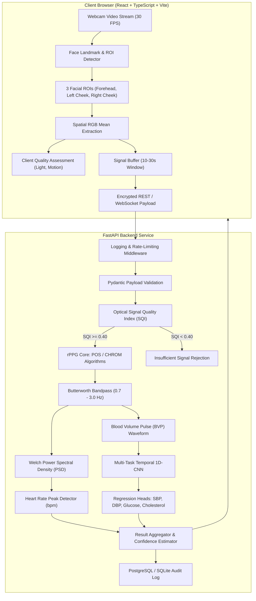

# FaceVital AI — System Architecture & Technical Specifications

> **RESEARCH PROTOTYPE DISCLAIMER**
> FaceVital AI is an experimental computer vision and machine learning platform. It is engineered strictly for research exploration and algorithmic benchmarking of remote photoplethysmography (rPPG). It does **NOT** provide clinical diagnostic interpretations.

---

## 1. System Overview

FaceVital AI captures high-definition video from an ordinary client webcam, identifies and tracks anatomical facial regions of interest (ROIs), extracts micro-vascular blood absorption dynamics, and infers cardiovascular and systemic physiological markers.



---

## 2. Component Specifications

### 2.1 Video Ingestion & Facial ROI Tracking
- **Sampling Rate:** Ideal 30.0 FPS, adaptive timestamp synchronization.
- **Regions of Interest (ROIs):**
  - **Forehead:** Centers on frontal bone epidermis, minimal hair and muscle artifact.
  - **Left Cheek (Malar region):** Dense superficial vascular bed.
  - **Right Cheek (Malar region):** Bilateral vascular balance.
- **Spatial Averaging:**
  For each ROI $\mathcal{R}$ in frame $t$:
  $$C(t) = \frac{1}{|\mathcal{R}|} \sum_{(x,y) \in \mathcal{R}} I(x, y, t)$$
  where $I(x,y,t)$ is the RGB pixel vector. Spatial averaging reduces high-frequency sensor noise by $\sqrt{|\mathcal{R}|}$.

---

### 2.2 rPPG Pulse Extraction Pipeline
FaceVital AI implements two benchmark algorithms:

#### A. Plane-Orthogonal-to-Skin (POS) Algorithm (Wang et al., 2017)
- Computes normalized color signals:
  $$C_n(t) = \frac{C(t)}{\mu_C}$$
- Projects normalized RGB into two orthogonal chrominance signals:
  $$S_1(t) = G_n(t) - B_n(t)$$
  $$S_2(t) = G_n(t) + B_n(t) - 2R_n(t)$$
- Calculates the adaptive tuning factor $\alpha$:
  $$\alpha(t) = \frac{\sigma(S_1)}{\sigma(S_2)}$$
- Yields the blood volume pulse (BVP):
  $$\text{BVP}(t) = S_1(t) + \alpha(t) S_2(t)$$

#### B. Chrominance-Based (CHROM) Method (de Haan & Jeanne, 2013)
- Projects skin-color variations onto color-difference vectors:
  $$X_s = 3R_n - 2G_n$$
  $$Y_s = 1.5R_n + G_n - 1.5B_n$$
- Projects onto pulse vector:
  $$\text{BVP}_{\text{chrom}} = X_s - \frac{\sigma(X_s)}{\sigma(Y_s)} Y_s$$

---

### 2.3 Optical Signal Quality Index (SQI)
Before feeding temporal signals to neural inference, the pipeline evaluates a composite quality metric:
$$\text{SQI} = w_1 Q_{\text{brightness}} + w_2 Q_{\text{stability}} + w_3 Q_{\text{consistency}} + w_4 Q_{\text{SNR}} + w_5 Q_{\text{periodicity}} + w_6 Q_{\text{length}}$$

| Component | Target Window | Weight | Rejection Threshold |
| :--- | :--- | :--- | :--- |
| **Brightness** | Mean pixel intensity $\in [50, 200]$ | 0.15 | $< 30$ or $> 240$ |
| **Temporal Stability** | Frame coefficient of variation (CV) $< 0.10$ | 0.20 | Head motion spike $> 0.25$ |
| **ROI Consistency** | Inter-ROI cross-correlation $> 0.70$ | 0.10 | Dissimilar lighting across cheeks |
| **SNR** | Bandpass pulsatile power vs non-pulsatile noise | 0.25 | $\text{SNR} < -3\text{ dB}$ |
| **Periodicity** | Welch PSD dominant peak sharpness | 0.20 | Diffuse spectral power distribution |
| **Signal Duration** | Temporal length $\ge 6.0\text{ s}$ | 0.10 | $< 4.0\text{ s}$ |

---

### 2.4 Multi-Task Biomarker Neural Network
```
Input: Tensor (Batch, 9 Channels, T Time Frames)
  │
  ├─ Conv1D Stem (Kernel 7, Filters 64, Stride 1) + BatchNorm1D + ReLU
  │
  ├─ Temporal Residual Block 1 (Dilation 1, Kernel 5)
  ├─ Temporal Residual Block 2 (Dilation 2, Kernel 5)
  ├─ Temporal Residual Block 3 (Dilation 4, Kernel 5)
  ├─ Temporal Residual Block 4 (Dilation 8, Kernel 5)
  │
  ├─ Multi-Scale Spatial Pyramid Pooling (Pool sizes: 1, 2, 4)
  │
  ├─ Shared Latent Embedding (Dense 128) + Dropout(0.3)
  │
  ├─ Head 1 (SBP): Dense 64 → Dense 1 (mmHg)
  ├─ Head 2 (DBP): Dense 64 → Dense 1 (mmHg)
  ├─ Head 3 (Glucose): Dense 64 → Dense 1 (mg/dL)
  └─ Head 4 (Cholesterol): Dense 64 → Dense 1 (mg/dL)
```

---

## 3. Database Schema

The backend uses SQLAlchemy ORM with async PostgreSQL support:
- `users`: Authentication identities with hashed credentials.
- `sessions`: Measurement recording events, device metadata, duration, average SQI.
- `measurements`: Prediction records containing vital estimates, confidence scores, and timestamps.
